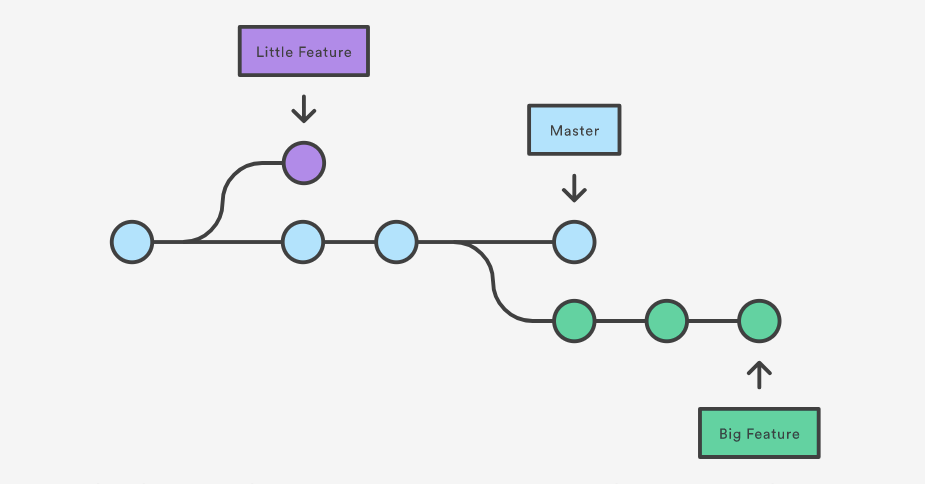

Introduction to Github
======================

## Github Desktop

Version control systems are a category of software tools that help a software team manage changes to source code over time. This helps a team to collaborate in a multi-developer project without stepping on each other's work.

Github is a distributed system so you can develop your code offline or connected to the internet.  To do this, the code you work on is on a local repo which is separate from the remote repo (in the cloud).  When you edit and commit your code, it is alwasy on your local repo.  The remote repo does not know about your local repo until you sync your local work to the remote repo.  With multiple developers, everyone is getting their code from the remote repo when they want to refresh their code with the latest updates.  It's important to check-in and sync your code when finish to minimize conflicts.

## Getting Started
Install Github Desktop for your operating system.

https://docs.github.com/en/free-pro-team@latest/desktop/installing-and-configuring-github-desktop/getting-started-with-github-desktop

## Create a New Repository

1. Create your own repo, IntroToGithub in the Web UI and sync it to your local Github repo.
   Make a note where on the file system you have configured Github to save your projects/repos

[Create a New Github Repo](https://youtu.be/9GILbk78S7I)

## Change a file & Add a new file to repo

2. Create a file called README.md and a file called helloworld.py

3. Edit README.md & helloworld.py and save them.  In github, if you save a markdown file with the name README.md, it will display the formatted text on the repo's main page.

4. In Github Desktop, add a comment and hit commit.
   Remember to "Push origin" which sync your local commits to the remote repo

5. Check the github.com for your account and repo to see the changes.

[Change a file and add a new file to repo](https://youtu.be/takdNeJmrB8)

## Make a branch

To develop you code, it is recommended to create a branch to minimize bad / untested code going into the master branch.

6. Create a branch in Github Desktop (provide a unique name)

7. Switch your Github Desktop to the "Current Branch", fill in a new name and click "Create New Branch"

8. Make your changes to your files locally and save them

9. In Github Desktop, add a comment and hit commit.
   Remember to "Push origin" which sync your local commits to the remote repo

10. Check the github.com for your repo and your branch to verify your new code is there

[Make a branch and commit to branch](https://youtu.be/DUH_N50A9i4)

## Merge Branch and Resolve Conflicts

A pull request is to signal to the repo administrators that you are requesting your changes to be merged to the main branch.  As an administrator, you can review, reject changes, provide constructive feedback on how the changes can be improved and accept & merge the changes into the main branch.

11. As a developer, request a Pull Request.

12. As an administrator, review and merge the 1st Pull Request.

13. As an adminstrator, review and merge the 2nd Pull Request.  If there are any conflicts, manually merge (i.e. make changes) the new code into the main branch.

[Merge Branch and Resolve Conflicts](https://youtu.be/FAJ2e0gDnHY)

## Clean up Branches

Lastly, after your projects and work-in-progress are done and have merged into the main branch, it is a good practice to remove older branches.  Sometimes older repos have been superceded with new repos, you may delete old repos if necessary.

[Clean up branches](https://youtu.be/xEZdKLvRMb8)
